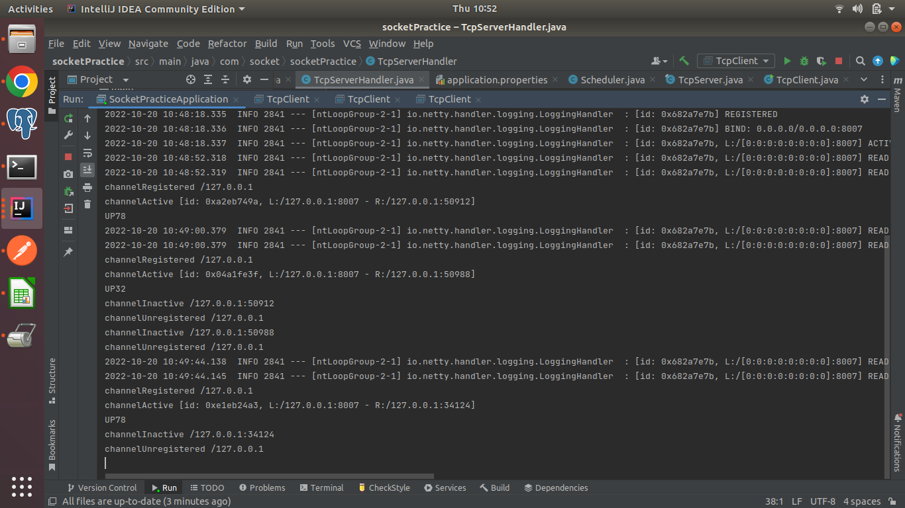

# TCP NETTY SOCKET

### TCP Server

````
For up the TCP server at port 8007
Run main application SocketPracticeApplication.java
````

### TCP Client

````
For TCP client create and run multiple instance
Run client.TcpClient.java
````

At client console-

enter room name : (for demo it is UP78 for other room name there is no data exists)


